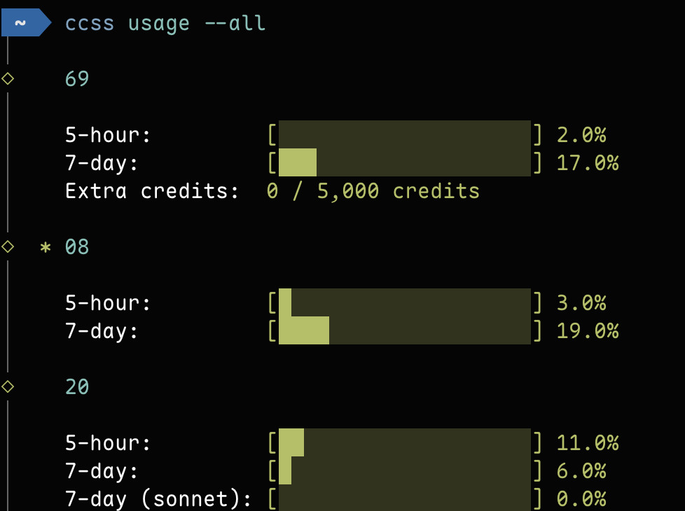

# CCSS - Claude Code Subscription Switch

Language: [🇺🇸 English](./README.md) | 🇨🇳 简体中文

一个用于在单台机器上管理和切换多个 Claude Code 订阅账号的 TUI 工具。

## 安装

```bash
# npm
npm install -g cc-subscription-switch

# bun
bun install -g cc-subscription-switch
```

或者无需安装直接运行：

```bash
npx cc-subscription-switch
# 或
bunx cc-subscription-switch
```

## 使用

### 交互式账号选择


```bash
# 选择账号并启动 Claude
ccss

# 传递参数给 Claude
ccss -p "help me"
ccss --model sonnet
ccss --dangerously-skip-permissions
```

### 账号管理

```bash
# 添加新账号
ccss add <name>

# 删除账号
ccss remove <name>

# 列出所有账号（附带用量进度条）
ccss list

# 显示当前账号（附带用量进度条）
ccss whoami

# 显示配置目录路径
ccss config

# 同步账号设置
ccss sync <name>
```

### 用量查看



```bash
# 查看当前账号用量
ccss usage

# 查看所有账号用量
ccss usage --all
```

显示 5 小时和 7 天利用率的彩色进度条（绿色 → 黄色 → 红色），以及额外积分使用情况（如已启用）。数据缓存 5 分钟。需要 macOS（从 Keychain 或 `.credentials.json` 读取 OAuth 凭证）。

## 工作原理

每个账号的 Claude 配置存储在 `~/.cc-subscription-switch/accounts/<name>/` 的独立目录下。选择账号时，CCSS 会将 `CLAUDE_CONFIG_DIR` 指向该账号的目录来启动 Claude。

### 添加账号

1. 运行 `ccss add <name>`
2. 输入可选的描述信息
3. 配置设置（可选）：
   - 应用 `~/.cc-subscription-switch/settings.json` 中的通用设置
   - 从全局设置 `~/.claude/settings.json` 同步（排除账号特有字段和 env）
   - 手动编辑设置
4. 同步 skills 目录（可选，当 `~/.claude/skills/` 存在时）：
   - **软链接**（推荐）— 共享同一目录，修改在所有账号间同步
   - **复制** — 创建独立副本
   - **跳过**
5. Claude 会打开进行首次登录（引导流程）
6. 完成登录后，在 Claude 中输入 `/exit` 返回
7. 登录成功后账号即添加完成

### 设置同步

CCSS 支持在账号之间同步设置：

- **通用设置**：存储在 `~/.cc-subscription-switch/settings.json` 的共享设置
- **全局设置**：位于 `~/.claude/settings.json` 的主 Claude 设置

从全局设置同步时，以下账号特有字段会被排除：
- `accountId`、`userId`、`email`、`oauthAccount`、`primaryOrganization`、`env`

使用 `ccss sync <name>` 为已有账号配置设置，或将当前账号的设置保存为通用设置。

### Skills 同步

添加账号或运行 `ccss sync <name>` 时，如果 `~/.claude/skills/` 存在且非空，会提示同步 skills 目录：

- **软链接**：创建指向 `~/.claude/skills/` 的符号链接 — 所有账号共享同一 skills，修改即时同步。
- **复制**：为该账号创建独立的 skills 目录副本。
- **跳过**：不同步 skills。

## 开发

```bash
bun run dev
```
